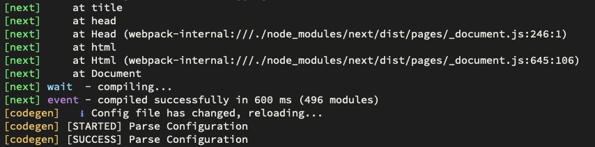

::: warning

This note contains only the "difficult" parts when creating a Next.js website from Wordpress. You should read [the official documetation](https://github.com/vercel/next.js/tree/canary/examples/cms-wordpress) and also things mentioned in [this note](/build-a-website-using-wordpress-and-gatsby-1/) (it's about Gatsby and WP).

:::

::: info

I prefer Next.js other than Gatsby when using with Wordpress because I want to **use for free** the ["incremental building" functionality](https://vercel.com/docs/concepts/incremental-static-regeneration/overview#on-demand-revalidation). As I know, if we want [something like that](https://support.gatsbyjs.com/hc/en-us/articles/360053099253-Gatsby-Builds-Full-Incremental-and-Cloud) with Gatsby, we have to use [Gatsby Cloud (paid tiers)](https://www.gatsbyjs.com/pricing).

:::

## Getting started

:point_right: **IMPORTANT**: ==Use [this official starter](https://github.com/vercel/next.js/tree/canary/examples/cms-wordpress)== (it uses [TypeScript](https://www.typescriptlang.org/), [Tailwind CSS](https://tailwindcss.com/)).

::: warning

The following steps are heavily based on this starter, which means that some packages/settings have already been set up by this starter.

:::

Using **[Local](https://localwp.com/)** for a local version of Wordpress (WP) site. Read more in [this blog](/build-a-website-using-wordpress-and-gatsby-1/#create-a-local-copy-of-math2it). ==From now, I use **math2it.local**== for a local WP website in this note and ==**math2it.com**== for its production version.

In WP, install and activate plugin [WPGraphQL](https://wordpress.org/plugins/wp-graphql/).

Copy `.env.local.example` to `.env.local` and change it content.

```bash
npm i
npm run dev
```

The site is running at http://localhost:3000.

## Basic understanding: How it works?

How pages are created?

- `pages/abc.tsx` leads to `locahost:3000/abc`
- `pages/xyz/abc.tsx` leads to `localhost:3000/xyz/abc`
- `pages/[slug].tsx` leads to `localhost:3000/<some-thing>`. In this file,
  - We need `getStaticPaths` to generates all the post urls.
  - We need `getStaticProps` to generate the `props` for the page template. In this props, we get the data of the post which is going to be created! How? It gets the `params.slug` from the URL (which comes from the pattern `pages/[slug].tsx`). We use this params to get the post data. The `[slug].tsx` helps us catch the url's things. Read more about [the routing](https://nextjs.org/docs/routing/introduction).
  - Note that, all neccessary pages will be created before deploying (that why we call it *static*)

## Vercel CLI

Build and run vercel environment locally before pushing to the remote.

👉  [Vercel CLI – Vercel Docs](https://vercel.com/docs/cli)

```bash
npm i -g vercel
```

Link to the current project

```bash
vercel dev
# and then choose the corresponding options
```

Run build locally,

```bash
vercel build
```

## Styling

### SCSS / SASS

```bash
npm install --save-dev sass
```

:point_right: [Basic Features: Built-in CSS Support | Next.js](https://nextjs.org/docs/basic-features/built-in-css-support)

Define `/styles/main.scss` and import it in `_app.tsx`,

```tsx
import '../styles/main.scss'
```

### Work with Tailwind

👉 [Oficial and wonderful documentation](https://tailwindcss.com/docs/).

✳️ Define a new class,

```scss
// in a css file
@layer components {
  .thi-bg {
    @apply bg-white dark:bg-main-dark-bg;
  }
}
```

Use as: `className="thi-bg"`

✳️ Define a new color,

```js
// tailwind.config.js
module.exports = {
 theme: {
   extend: {
     colors: {
       main: '#1e293b'
     }
   }
 } 
}
```

Use as: `className="text-main bg-main"`

✳️ Custom and dynamic colors,

```tsx
// './src/styles/safelist.txt'
bg-[#1e293b]
```

```js
// tailwind.config.js
module.exports = {
  content: [
    './src/styles/safelist.txt'
  ]
}
```

Use as: `className="bg-[#1e293b]"`

## Preview mode

Check [this doc](https://github.com/vercel/next.js/tree/canary/examples/cms-wordpress#step-6-try-preview-mode) and the following instructions.

Install and activate WP plugin [wp-graphql-jwt-authentication](https://github.com/wp-graphql/wp-graphql-jwt-authentication).

Modify `wp-config.php`,

```php
define( 'GRAPHQL_JWT_AUTH_SECRET_KEY', 'daylamotkeybimat' );
```

Get a refresh token with GraphiQL IDE (at *WP Admin > GraphQL > GraphiQL IDE*),

```graphql
mutation Login {
  login(
    input: {
      clientMutationId: "uniqueId"
      password: "your_password"
      username: "your_username"
    }
  ) {
  	refreshToken
  }
}
```

Modify `.env.local`

```bash
WORDPRESS_AUTH_REFRESH_TOKEN="..."
WORDPRESS_PREVIEW_SECRET='daylamotkeybimat' # the same with the one in wp-config.php
```

Link the preview (`id` is the id of the post, you can find it in the post list).

```bash
# "daylamotkeybimat" is the same as WORDPRESS_PREVIEW_SECRET
http://localhost:3000/api/preview?secret=daylamotkeybimat&id=12069
```

::: warning

It may not work with *math2it.local* but *math2it.com* (the production version).

:::

## Dev environment

✳️ VSCode + ESLint + Prettier.

Follow instructions in [this blog](/build-a-website-using-wordpress-and-gatsby-1/#eslint-%26-vscode-%26-prettier) with **additional things**,

```js
// Add to .eslintrc
{
  rules: {},
	extends: ['next'],
	ignorePatterns: ['next-env.d.ts']
}
```

:beetle:  _Error: Failed to load config "next" to extend from_?

```bash
npm i -D eslint-config-next
```

✳️ Problem `Unknown at rule @apply` when using TailwindCSS.

Add the folloing settings in the VSCode settings,

```json
"css.validate": false, // used for @tailwindcss
"scss.validate": false, // used for @tailwindcss,
```

### Troubleshooting after confuguring

✳️ *'React' must be in scope when using JSX*

```js
// Add this line to the top of the file
import React from 'react';
```

✳️ _...is missing in props validation_

```tsx
// Before
export default function Layout({ preview, children }) {}

// After
type LayoutProps = { preview: boolean; children: React.ReactNode }
export default function Layout(props: LayoutProps) {
  const { preview, children } = props
}
```

### Prettier things

``` bash
npm install --save-dev @trivago/prettier-plugin-sort-imports
npm install -D prettier prettier-plugin-tailwindcss
```

In `.prettierrc`,

```json
{
  "plugins": [
    "./node_modules/@trivago/prettier-plugin-sort-imports",
    "./node_modules/prettier-plugin-tailwindcss"
  ],
  "importOrder": ["^@core/(.*)$", "^@server/(.*)$", "^@ui/(.*)$", "^[./]"],
  "importOrderSeparation": true,
  "importOrderSortSpecifiers": true
}
```

## Check ESLint server

There are some rules taking longer than the others. Use below command to see who they are.

```bash
TIMING=1 npx eslint lib
Rule                                   | Time (ms) | Relative
:--------------------------------------|----------:|--------:
tailwindcss/no-custom-classname        |  6573.680 |    91.0%
prettier/prettier                      |   543.009 |     7.5%
```

If you wanna turn off some rules (check [more options](https://eslint.org/docs/latest/user-guide/configuring/rules#disabling-rules)),

```js
// .eslintrc.js
{
  rules: {
    'tailwindcss/no-custom-classname': 'off'
  }
}
```

Run `TIMING=1 npx eslint lib` again to check!

## Types for GraphQL queries

::: warning

**Update**: I decide to use self-defined types for what I use in the project.

:::

We use [GraphQL Code Generator](https://www.the-guild.dev/graphql/codegen) (or *codegen*). Read [the official doc](https://www.the-guild.dev/graphql/codegen/docs/getting-started/installation).

### Install codegen

```bash
npm install graphql
npm install -D typescript
npm install -D @graphql-codegen/cli
```

```bash
npx graphql-code-generator init
```

Below are my answers,

```bash
? What type of application are you building? Application built with React
? Where is your schema?: (path or url) http://math2it.local/graphql
? Where are your operations and fragments?: graphql/**/*.graphql
? Where to write the output: graphql/gql
? Do you want to generate an introspection file? No
? How to name the config file? codegen.ts
? What script in package.json should run the codegen? generate-types
```

::: hsbox An example of the final `codegen.ts`

```typescript
import { loadEnvConfig } from '@next/env'
import type { CodegenConfig } from '@graphql-codegen/cli'
loadEnvConfig(process.cwd())

const config: CodegenConfig = {
  overwrite: true,
  schema: process.env.WORDPRESS_API_URL,
  documents: ['graphql/**/*.graphql', 'lib/api.ts'],
  generates: {
    'graphql/gql': {
      preset: 'client',
      plugins: [],
    },
  },
}
export default config
```

:::

```bash
# install the chosen packages
npm install
```

### Use codegen with env variable

👉 [Official doc](https://nextjs.org/docs/basic-features/environment-variables).

Want to use **next.js's environment variable** (`.env.local`) in the codegen's config file? Add the following codes to `codegen.ts`,

```tsx
import { loadEnvConfig } from '@next/env'
loadEnvConfig(process.cwd())

// then you can use
const config: CodegenConfig = {
  schema: process.env.WORDPRESS_API_URL,
}
```

### Generate types

Generate the types,

```bash
npm run generate-types
```

If you want to run in watch mode aloside with `npm run dev`,

```bash
npm i -D concurrently
```

Then modify `package.json`,

```json
{
  "scripts": [
    "dev": "concurrently \"next\" \"npm run generate-types-watch\" -c green,yellow -n next,codegen",
    "generate-types-watch": "graphql-codegen --watch --config codegen.ts"
  ]
}
```

Now, just use `npm run dev` for both. What you see is something like this



### Usage

For example, you want to query categories from `http://math2it.local/graphql` with,

```graphql
"""file: graphql/categories.graphql"""
query Categories {
  categories {
    edges {
      node {
        name
      }
    }
  }
}
```

After run the generate code, we have type `CategoriesQuery` in `graphql/gql/graphql.ts` (==the name of the type is in the formulas `<nameOfQuery>Query`==). You can import this type in a `.tsx` component as follow,

```tsx
// components/categories.tsx
import { CategoriesQuery } from '../graphql/gql/graphql'

export default function Categories(props: CategoriesQuery) {
  const { categories } = props
	return (
  	{ categories.edges.map(...) }
  )
}
```

### Make codegen recognize query in `lib/api.ts`

Add `/* GraphQL */ ` before the query string! Read more in [the official doc](https://www.the-guild.dev/graphql/codegen/docs/config-reference/documents-field#available-formats) for other use cases and options!

```typescript
// From this
const data = await fetchAPI(`
	query PreviewPost($id: ID!, $idType: PostIdType!) {
    post(id: $id, idType: $idType) {
      databaseId
      slug
      status
    }
	}`
)
```

```typescript
// To this
const data = await fetchAPI(
  /* GraphQL */ `
	query PreviewPost($id: ID!, $idType: PostIdType!) {
    post(id: $id, idType: $idType) {
      databaseId
      slug
      status
    }
	}`
)
```

## Use with Apollo Client

[The starter](https://github.com/vercel/next.js/tree/canary/examples/cms-wordpress) we use from the beginning of this note is using typescript's built-in `fetch()` to get the data from WP GraphQL (check the content of `lib/api.ts`). You can use [Apollo Client](https://www.apollographql.com/docs/react/get-started) instead.

```bash
npm install @apollo/client graphql
```

```tsx
// Modify lib/api.ts
const client = new ApolloClient({
  uri: process.env.WORDPRESS_API_URL,
  cache: new InMemoryCache(),
})

async function fetchAPI() {
  export async function getAllPostsForHome() {
    const { data } = await client.query({
      query: gql`
        query AllPosts {
          posts(first: 20, where: { orderby: { field: DATE, order: DESC } }) {
            edges {
              node {
                title
                excerpt
              }
            }
          }
        }
      `,
    })
  	return data?.posts
  }
}
```

```tsx
// pages/index.tsx
import { getAllPostsForHome } from '../lib/api'

export default function Index({ allPosts: { edges } }) {
  return ()
}

export const getStaticProps: GetStaticProps = async () => {
  const allPosts = await getAllPostsForHome()
  return {
    props: { allPosts },
    revalidate: 10,
  }
}
```

## GraphQL things

✳️ Query different queries in a single query with alias,

```graphql
query getPosts {
  posts: posts(type: "POST") {
    id
		title
  }
  comments: posts(type: "COMMENT") {
    id
		title
  }
}
```

Otherwise, we get an error _Fields 'posts' conflict because they have differing arguments. Use different aliases on the fields to fetch both if this was intentional._

## Images

👉 [Basic Features: Image Optimization | Next.js](https://nextjs.org/docs/basic-features/image-optimization)
👉 [next/image | Next.js](https://nextjs.org/docs/api-reference/next/image)
👉 (I use this) [next/future/image | Next.js](https://nextjs.org/docs/api-reference/next/future/image)

Local images,

```tsx
import profilePic from '../public/me.png'
<Image
  src={profilePic}
  alt="Picture of the author"
/>
```

Inside an `<a>` tag?

```tsx
<Link href={`/posts/${slug}`} passHref>
  <a aria-label={title}>
  	<Image />
  </a>
</Link>
```

I use below codes,

(To apply ["blur" placeholder effect](https://nextjs.org/docs/api-reference/next/image#placeholder) for external images, we use [plaiceholder](https://plaiceholder.co/usage))

```tsx
// External images
<div style="position: relative;">
	<Image
    alt={imageAlt}
    src={featuredImage?.sourceUrl}
    className={imageClassName}
    fill={true} // requires father having position "relative"
    sizes={featuredImage?.sizes || '100vw'} // required
    placeholder={placeholderTouse}
    blurDataURL={blurDataURLToUse}
	/>
</div>

// Internal images
<Image
  alt={imageAlt}
  src={defaultFeaturedImage}
  className={imageClassName}
  priority={true}
/>
```

::: warning

- If you use `fill={true}` for `Image`, its parent must have position "relative" or "fixed" or "absolute"!
- If you use *plaiceholder*, the building time takes longer than usual. For my site, after applying *plaiceholder*, the building time increases from *1m30s* to *2m30s* on vercel!

:::

:beetle: _Invalid next.config.js options detected: The value at .images.remotePatterns[0].port must be 1 character or more but it was 0 characters._

Remove `port: ''`!

## Loading placeholder div for images

::: tip

We use only the CSS for the placeholder image. We gain the loading time and also the building time for this idea!

:::

If you wanna add a div (with loading effect CSS only).

```tsx
// In the component containing <Image>
import Image from 'next/image'
import { useState } from 'react'

export default function ImageForPost({ title, featuredImage, blurDataURL, categories }) {
  const [isImageReady, setIsImageReady] = useState(false)
  const onLoadCallBack = () => {
    setIsImageReady(true)
  }
  const image = (
  	<Image
      alt={imageAlt}
      src={externalImgSrc}
      className={imageClassName}
      fill={true}
      sizes={externalImgSizes || '100vw'}
      onLoadingComplete={onLoadCallBack}
    />
  )
  return (
  	<>
      <div className="block h-full w-full md:animate-fadeIn">{image}</div>
    	{!isImageReady && (
        <div className="absolute top-0 left-0 h-full w-full">
          <div className="relative h-full w-full animate-pulse rounded-lg bg-slate-200">
            <div className="absolute left-[14%] top-[30%] z-20 aspect-square h-[40%] rounded-full bg-slate-300"></div>
            <div className="absolute bottom-0 left-0 z-10 h-2/5 w-full bg-wave"></div>
          </div>
        </div>
  		)}	
    </>
}
```


## Custom fonts

👉 [Basic Features: Font Optimization | Next.js](https://nextjs.org/docs/basic-features/font-optimization)
👉 [google-font-display | Next.js](https://nextjs.org/docs/messages/google-font-display)

Some remarks:

- Using `display=optional`

  ```html
  https://fonts.googleapis.com/css2?family=Krona+One&display=optional"
  ```

- Add Google font to `pages/_document.js`, nextjs will handle the rest.

::: info

Next.js [currently supports optimizing](https://nextjs.org/docs/basic-features/font-optimization) Google Fonts and Typekit.

:::

## Routes

👉  [Routing: Introduction | Next.js](https://nextjs.org/docs/routing/introduction)

[Catch all routes](https://nextjs.org/docs/routing/dynamic-routes#catch-all-routes): `pages/post/[...slug].js` matches `/post/a`, but also `/post/a/b`, `/post/a/b/c` and so on.

[Optional catch all routes](https://nextjs.org/docs/routing/dynamic-routes#optional-catch-all-routes): `pages/post/[[...slug]].js` will match `/post`, `/post/a`, `/post/a/b`, and so on.

[The order](https://nextjs.org/docs/routing/dynamic-routes#caveats): predefined routes > dynamic routes > catch all routes

::: hsbox Using `encodeURIComponent`

```tsx
<ul>
  {posts.map((post) => (
    <li key={post.id}>
      <Link href={`/blog/${encodeURIComponent(post.slug)}`}>
        <a>{post.title}</a>
      </Link>
    </li>
  ))}
</ul>;

```

:::

## Components

### Navigation bar

Fetch menu data from WP and use it for `navigation` component? [Read this](https://nextjs.org/docs/basic-features/layouts#data-fetching) for an idea. **Note that**, this data is **fetched on the client-side** using [Vercel's SWR](https://swr.vercel.app/).

::: tip

I create a constant `MENUS` which defines all the links for the navigation. I don't want to fetch on the client side for this fixed menu.

:::

Different classes for currently active menu?

```tsx
import cn from 'classnames'
import { useRouter } from 'next/router'

export default async function Navigation() {
  const router = useRouter()
  const currentRoute = router.pathname
	return (
  	{menus?.map((item: MenuItem) => (
      <Link key={item?.id} href={item?.url as string}>
        <a
          className={isActiveClass(
            item?.url === currentRoute
          )}
          aria-current={
            item?.url === currentRoute ? 'page' : undefined
          }
          >
          {item?.label}
        </a>
      </Link>
    ))}
  )
}

const isActiveClass = (isCurrent: boolean) => 
	cn(
  	'fixed-clasess',
    { 'is-current': isCurrent, 'not-current': !isCurrent }
  )
```

Remark: `router`'s `pathname` has a weekness when using with dynamic routes, [check this](https://amanexplains.com/using-aria-current-for-nav-links/) for other solutions.

### Taxonomy pages

URL format from Wordpress: `/category/math/` or `/category/math/page/2/` 👉 Create `/pages/category/[[...slug]].tsx` ([Read more about optional catching all routes](https://nextjs.org/docs/routing/dynamic-routes#optional-catch-all-routes))

To query posts with "offset" and "limit", use [this plugin](https://github.com/valu-digital/wp-graphql-offset-pagination/tree/stable).

**Remark**: When querying with graphql, `$tagId` gets type `String` whereas `$categoryId` gets type `Int`!

### Search

If you need: when submitting the form, the site will navigate to the search page at `/search/?s=query-string`, use [`router.push()`](https://nextjs.org/docs/api-reference/next/router#routerpush)!

```tsx
import { useRef, useState } from 'react'
import { useRouter } from 'next/router'

export default function Navigation() {
	const router = useRouter()
  const [valueSearch, setValueSearch] = useState('')
  const searchInput = useRef(null)
  return (
  	<form onSubmit={e => {
      e.preventDefault()
      router.push(`/search/?s=${encodeURI(valueSearch)}`)
    }}
    >
    	<button type="submit">Search</button>
      <input
        type="search"
        value={valueSearch}
        ref={searchInput}
        onChange={e => setValueSearch(e.target.value)}
      />
    </form>
  )
}
```

👉 Read more: [SWR data fetching](https://swr.vercel.app/docs/data-fetching#graphql).
👉 Read more: [Client-side data fetching](https://nextjs.org/docs/basic-features/data-fetching/client-side).

```tsx
import React from 'react'
import Layout from '../components/layout'
import useSWR from 'swr'
import Link from 'next/link'

export default function SearchPage() {
  const isBrowser = () => typeof window !== 'undefined'
  let query = ''
  if (isBrowser()) {
    const { search } = window.location
    query = new URLSearchParams(search).get('s') as string
  }
  const finalSearchTerm = decodeURI(query as string)
  const { data, error } = useSWR(
    `
      {
        posts(where: { search: "` +
      finalSearchTerm +
      `" }) {
          nodes {
            id
            title
            uri
          }
        }
      }
    `,
    fetcher
  )

  return (
    <Layout>
      <div className="pt-20 px-8">
        <div className="text-3xl">This is the search page!</div>
        <div className="mt-8">
          {error && <div className="pt-20">Failed to load</div>}
          {!data && <div className="pt-20">Loading...</div>}
          {data && (
            <ul className="mb-6 list-disc pl-5">
              {data?.posts?.nodes.map(node => (
                <li key={node.id}>
                  <Link href={node.uri}>
                    <a>{node.title}</a>
                  </Link>
                </li>
              ))}
            </ul>
          )}
        </div>
      </div>
    </Layout>
  )
}

const fetcher = async query => {
  const headers: { [key: string]: string } = {
    'Content-Type': 'application/json',
  }
  const res = await fetch('http://math2it.local/graphql', {
    headers,
    method: 'POST',
    body: JSON.stringify({
      query,
    }),
  })
  const json = await res.json()
  return json.data
}
```


## General troubleshooting

✳️ _Warning: Function components cannot be given refs. Attempts to access this ref will fail. Did you mean to use React.forwardRef()?_

Have this when using

```tsx
const image = (<Image />)
// then
<Link href="">{image}</Link>
```

Wrap it with `<a>` tag,

```tsx
<Link href=""><a>{image}</a></Link>
```

:beetle: If you use `<a>`, a linting problem _The href attribute is required for an anchor to be keyboard accessible...._

```tsx
// Try <button> instead of <a>
<Link href=""><button>{image}</button></Link>
```

Or add below rule to `.eslintrc` (not that, estlint detects the problem but it's still valid from the accessibility point of view ). [Source](https://stackoverflow.com/a/47875838/1323473).

```js
rules: {
  'jsx-a11y/anchor-is-valid': [
    'error',
    {
      components: ['Link'],
      specialLink: ['hrefLeft', 'hrefRight'],
      aspects: ['invalidHref', 'preferButton'],
    },
  ],
}
```

👉 Read more in [the official tut](https://nextjs.org/docs/api-reference/next/link).

✳️  _Warning: A title element received an array with more than 1 element as children._

```tsx
// Instead of
<title>Next.js Blog Example with {CMS_NAME}</title>

// Use
const title = `Next.js Blog Example with ${CMS_NAME}`
<title>{title}</title>
```

Read [this answer](https://github.com/vercel/next.js/discussions/38256#discussioncomment-3070196) to understand the problem.

✳️  _Element implicitly has an 'any' type because expression of type '"Authorization"' can't be used to index type '{ 'Content-Type': string; }'._

```typescript
// This will fail typecheck
const headers = { 'Content-Type': 'application/json' }
headers['Authorization'] = `Bearer ${process.env.WORDPRESS_AUTH_REFRESH_TOKEN}`

// This will pass typecheck
const headers: { [key: string]: string } = { 'Content-Type': 'application/json' }
headers['Authorization'] = `Bearer ${process.env.WORDPRESS_AUTH_REFRESH_TOKEN}`
```

✳️ (Codegen's error) _[FAILED] Syntax Error: Expected Name, found ")"._

```tsx
// Instead of
query PostBySlug($id: ID!, $idType: PostIdType!) {
  post(id: $id, idType: $idType) {
    
// You have
query PostBySlug($id: ID!, $idType: PostIdType!) {
  post() { // <- here!!!
```

✳️  _You cannot define a route with the same specificity as a optional catch-all route ("/choice" and "/choice\[\[...slug\]\]")._

It's because you have both `/pages/choice/[[slug]].tsx` and `/pages/choice.tsx`. Removing one of two fixes the problem.

✳️  _Could not find declaration file for module 'lodash'_

```bash
npm i --save-dev @types/lodash
```

✳️  _TypeError: Cannot destructure property 'auth' of 'urlObj' as it is undefined._

Read this: [prerender-error | Next.js](https://nextjs.org/docs/messages/prerender-error). For my personal case, set `fallback: false` in `getStaticPath()` and I encountered also the problem of [trailing slash](https://nextjs.org/docs/api-reference/next.config.js/trailing-slash). On the original WP, I use `/about/` instead of `/about`. Add `trailingSlash: true` to the `next.config.js` fixes the problem.

✳️ _Error: Failed prop type: The prop `href` expects a `string` or `object` in `<Link>`, but got `undefined` instead._

There are some `Link`s getting `href` an `undefined`. Find and fix them or use,

```tsx
<Link href={value ?? ''}>...</Link>
```

✳️ Restore to the previous position of the page when clicking the back button (Scroll Restoration)

```js
// next.config.js
module.exports = {
	experimental: {
    scrollRestoration: true,
  },
}
```

**Remark**: You have to restart the dev server.


## References

- [Incremental Static Regeneration (ISR) – Vercel Docs](https://vercel.com/docs/concepts/incremental-static-regeneration/overview#on-demand-revalidation)
- [How to Update Static Content in Next.js Automatically with Incremental Static Regeneration (ISR) - Space Jelly](https://spacejelly.dev/posts/how-to-update-static-content-in-next-js-automatically-with-incremental-static-regeneration-isr)
- [On-Demand ISR – Vercel](https://vercel.com/templates/next.js/on-demand-incremental-static-regeneration)
- [Debugging](https://nextjs.org/docs/advanced-features/debugging)
